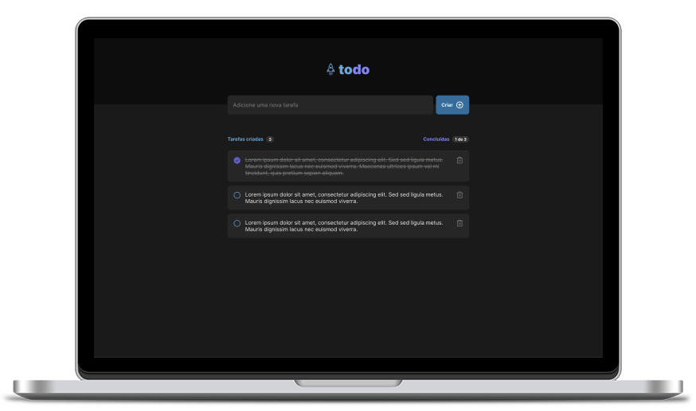

<p align="center">
  
</p>

<p align="center" style="font-weight:bold; font-size:24px;">TODO List</p>

<p align="center">
  

  

  
</p>

<div align="center">
  
</div>

<br>

## 💡 Introduction

TODO List web application

- Create a task
- Delete a task
- Mark a task as done (check)
- View all tasks statuses

<br>

## 🧪 Technologies and Services

- [React](https://reactjs.org)
- [Vite](https://vitejs.dev/)

<br>

## 🖥 Pre-requisites:

- NodeJS

<br/>

## 🚀 How to Run it?

From project's root file:

```sh
$ npm install
$ npm run dev
```

<br>

## 🔖 Layout

Check Figma Layout of this project [here](<https://www.figma.com/file/0n0zDN7zbzhRbaEO74Xesx/ToDo-List/duplicate>)

<br>

## 📝 License

MIT License © Yuri Paiva. Check [LICENSE](LICENSE) for more details

---

<br>

Made with 💜 &nbsp;by Yuri Paiva
